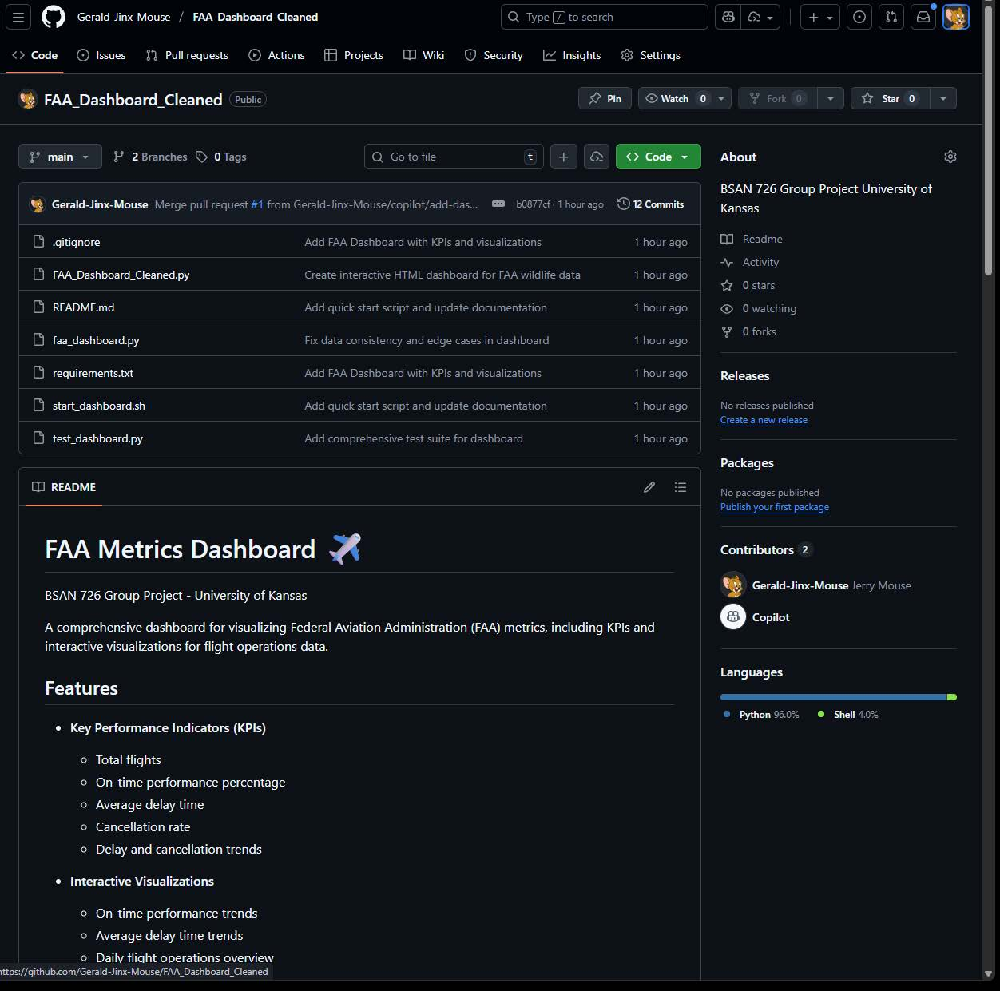
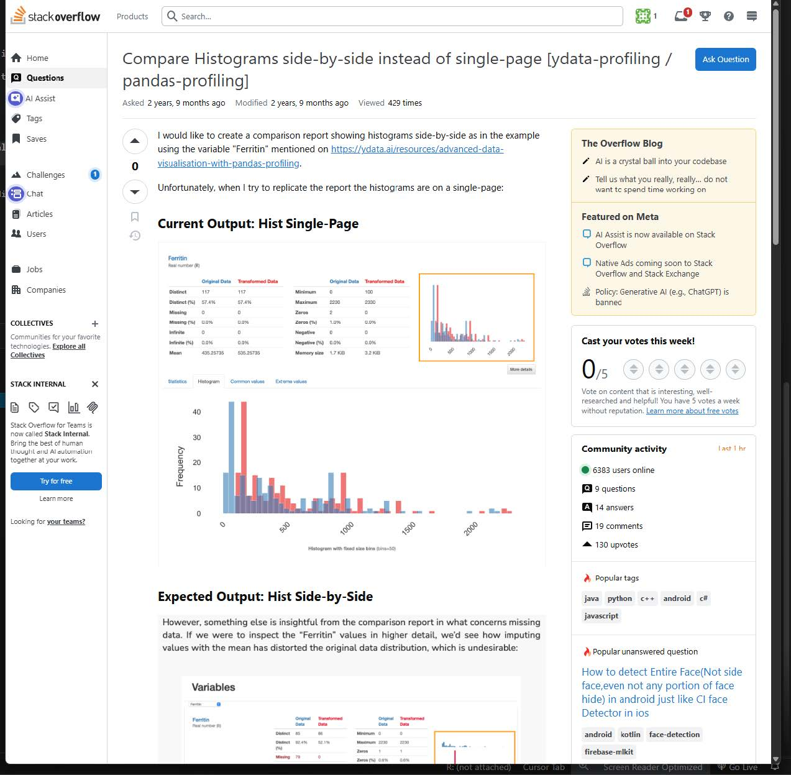
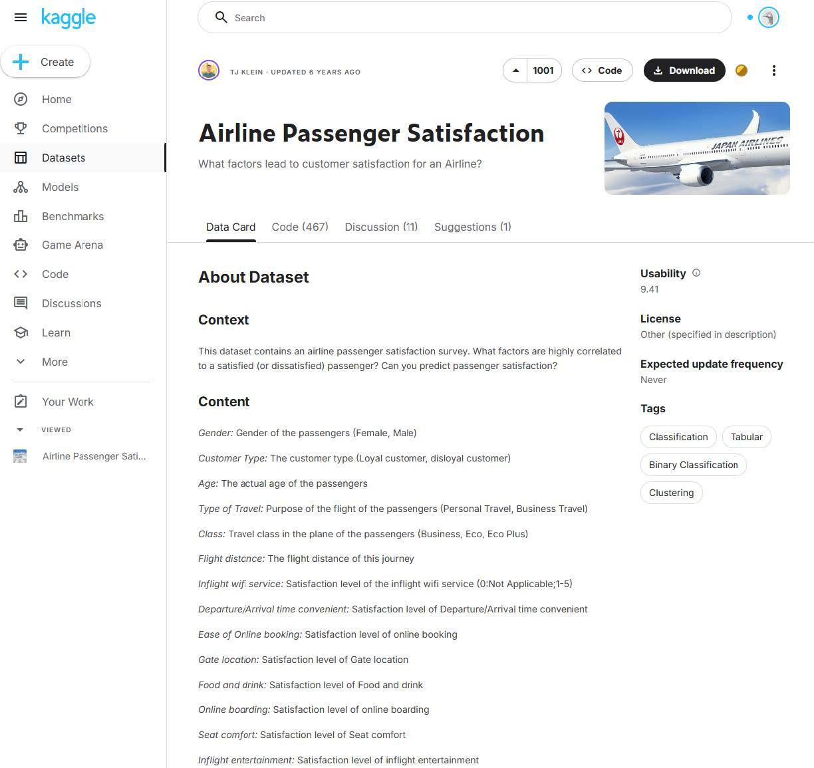

# My Journey Through Enterprise Data Management: From SQL to Big Data

*BSAN 726 Individual Reflection Essay | Jacob Keiter | Fall 2025*

---

## Introduction

In today's data-driven business landscape, the ability to effectively manage, transform, and analyze large volumes of data has become a critical skill for business analytics professionals. Enterprise Data Management (EDM) encompasses the processes, policies, and technologies that organizations use to acquire, store, maintain, and utilize data across their operations. This semester in BSAN 726, I embarked on a comprehensive journey through the foundations of data management, from relational database design and SQL querying to data warehousing concepts and big data technologies.

The course challenged me to think systematically about how data flows through an organization, from initial collection and storage in operational databases, through transformation and loading into analytical data warehouses, to processing at scale using distributed computing frameworks. Along the way, I gained hands-on experience with multiple tools and technologies including SQL, Python pandas, R, Apache Spark, and various database platforms. This essay reflects on my key learnings and demonstrates how these skills connect to form a cohesive understanding of enterprise data management.

---

## Database Fundamentals and SQL

The foundation of enterprise data management begins with understanding relational database design and SQL (Structured Query Language). During the first portion of the course, I learned how to design database schemas that enforce data integrity through primary keys, foreign keys, and constraints. In Assignment 1, I created a complete Purchase database schema with five interconnected tables: `PUR_CUSTOMER`, `PUR_PRODUCT`, `PUR_SALES`, `PUR_SALESPERSON`, and `PUR_SALES_CONTACT`.

Creating proper table structures requires careful consideration of data types and relationships. For example, when designing the `PUR_SALES` table, I defined foreign key constraints to ensure referential integrity:

```sql
CREATE TABLE PUR_SALES (
    SALES_ID INTEGER PRIMARY KEY,
    SALES_DATE DATE,
    PRODUCT_ID INTEGER,
    CUSTOMER_ID INTEGER,
    TOTAL_AMOUNT DECIMAL(10,2),
    CONSTRAINT fk_sales_product
        FOREIGN KEY (PRODUCT_ID) REFERENCES PUR_PRODUCT(PRODUCT_ID),
    CONSTRAINT fk_sales_customer
        FOREIGN KEY (CUSTOMER_ID) REFERENCES PUR_CUSTOMER(CUSTOMER_ID)
);
```

These constraints prevent orphaned records and maintain data consistency across the database. I also worked extensively with the RESTAURANT_ORDERS database, which challenged me to write complex queries involving multiple JOINs, GROUP BY clauses, and aggregate functions. One particularly insightful query calculated total purchases by restaurant for dishes originating from Houston:

```sql
SELECT d.DISHNAME, r.RESTAURANTNAME,
       ROUND(SUM(d.LISTPRICE * o.QUANT), 0) AS total_purchase
FROM RES_DISHES d
JOIN RES_ORDERS o ON d.DNUM = o.DNUM
JOIN RES_RESTAURANTS r ON o.RNUM = r.RNUM
WHERE d.CITYOFORIGIN = 'Houston'
GROUP BY d.DISHNAME, r.RESTAURANTNAME
ORDER BY d.DISHNAME, r.RESTAURANTNAME;
```

This query demonstrates the power of SQL for business analytics, combining data from multiple tables to answer complex questions about purchasing patterns and regional preferences.

---

## Data Wrangling: Python vs R

While SQL excels at querying structured databases, real-world data often requires additional cleaning and transformation before analysis. Assignment 2 introduced me to data wrangling using Python pandas and R, giving me perspective on when to use each tool.

Working with the FAA Wildlife Strike dataset (approximately 155,000 records), I learned to perform operations in pandas that mirror SQL functionality. For instance, counting incidents per year translates directly between SQL and Python:

**SQL Version:**
```sql
SELECT INCIDENT_YEAR, COUNT(*) AS incident_count
FROM FAA2025
GROUP BY INCIDENT_YEAR
ORDER BY INCIDENT_YEAR;
```

**Python pandas Version:**
```python
incidents_per_year = df.groupby("INCIDENT_YEAR").size().reset_index(name="incident_count")
incidents_per_year = incidents_per_year.sort_values("INCIDENT_YEAR")
```

I also discovered the power of automated data profiling tools. Using `ydata-profiling` (formerly pandas-profiler) in Python, I generated comprehensive HTML reports that automatically analyze data distributions, missing values, correlations, and potential data quality issues. The report for the FAA dataset was approximately 9MB and included interactive visualizations of all variables.

In R, the `DataExplorer` package provides similar functionality with a different approach. While Python pandas excels at programmatic data manipulation in data pipelines, R's strength lies in statistical analysis and visualization. Through this assignment, I learned that the choice between tools often depends on the specific task: Python for ETL pipelines and integration with other systems, R for statistical modeling and exploratory data analysis.

The most valuable lesson was understanding that data rarely comes clean. The FAA dataset contained significant missing values, only a small percentage of records had repair cost data, yet those records were critical for understanding the financial impact of wildlife strikes.

---

## Data Warehousing Concepts

Moving beyond operational databases, the course introduced data warehousing as the foundation for business intelligence and analytics. Unlike transactional databases optimized for day-to-day operations (OLTP), data warehouses are designed for analytical queries (OLAP) that aggregate historical data across multiple dimensions.

The star schema emerged as the central design pattern for data warehouses. In this architecture, a central fact table contains quantitative measures (like sales amounts or incident counts) surrounded by dimension tables that provide descriptive context (like time, location, or product categories). This denormalized structure sacrifices storage efficiency for query performance, critical when analysts need to aggregate millions of records.

I learned to distinguish between different types of facts:
- **Additive facts** can be summed across all dimensions (e.g., sales revenue)
- **Semi-additive facts** can only be summed across certain dimensions (e.g., account balances, you can sum across customers but not across time)
- **Non-additive facts** cannot be meaningfully summed (e.g., ratios, percentages)

The concept of **factless fact tables** was particularly interesting, tables that record events without numeric measures, such as tracking which products were promoted on which dates. These tables answer questions about what *happened* rather than *how much*.

Assignment 3 challenged me to implement a star schema using the Star Schema Benchmark (SSB), creating dimension tables for dates, customers, suppliers, and parts, connected to a central lineorder fact table. This hands-on experience reinforced how proper dimensional modeling enables the complex analytical queries that drive business decisions.

The **ETL (Extract, Transform, Load)** process that populates data warehouses presented its own challenges. Data from multiple source systems must be cleaned, standardized, and transformed before loading, a process that can account for 70-80% of a data warehousing project's effort.

---

## Big Data Technologies

When data volumes exceed what traditional databases can handle efficiently, distributed computing becomes necessary. The course introduced the Hadoop ecosystem and Apache Spark as solutions for processing data at scale.

**HDFS (Hadoop Distributed File System)** addresses storage challenges by distributing large files across clusters of commodity hardware. Rather than storing a file on a single server, HDFS breaks it into blocks (typically 128MB) and replicates each block across multiple nodes. This provides both scalability (add more nodes to store more data) and fault tolerance (if a node fails, replicas exist elsewhere).

**Apache Spark** revolutionized big data processing by keeping data in memory rather than writing to disk between operations, making it up to 100x faster than Hadoop MapReduce for certain workloads. The concept of Resilient Distributed Datasets (RDDs) allows programmers to work with distributed data using familiar operations like map, filter, and reduce, while Spark handles the complexity of parallelization.

Working with GCP Dataproc clusters gave me hands-on experience with cloud-based big data infrastructure. Launching a cluster, submitting Spark jobs, and managing distributed processing demonstrated how organizations can scale analytics without maintaining physical hardware.

The course also introduced **NoSQL databases** as alternatives to relational systems for specific use cases:
- **MongoDB** for document-oriented storage when schemas are flexible
- **Cassandra** for high-availability distributed systems
- **Neo4j** for graph data where relationships are as important as entities

Understanding when to use each technology, relational databases for structured data with complex relationships, NoSQL for flexibility and scale, Spark for large-scale batch processing, is crucial for modern data architects.

---

## Practical Application: FAA Wildlife Strike Dashboard

The culmination of my learning came through the group project, where we analyzed FAA Wildlife Strike data spanning 2019-2020. My primary contribution was developing an interactive Python dashboard using Plotly that visualized strike patterns across multiple dimensions.

The dashboard incorporates ten distinct visualizations examining the pandemic's impact on aviation safety. The data revealed a significant decrease in wildlife strikes during 2020, unsurprising given reduced flight activity, but the visualization made the magnitude immediately apparent. The geographic scatter map showed concentrations at major hub airports, while time-of-day analysis revealed that dusk presents the highest risk period.

Building this dashboard required integrating multiple skills from the course:

```python
# Filter data and create pandemic comparison column
df = df[(df['YEAR'] >= 2019) & (df['YEAR'] <= 2020)]
df['PANDEMIC'] = df['YEAR'].apply(lambda x: 'Before' if x == 2019 else 'During')

# Create time series for monthly trends
df['YEAR_MONTH'] = df['DATE'].dt.to_period('M').astype(str)
monthly = df.groupby(['YEAR_MONTH', 'PANDEMIC']).size().reset_index(name='Count')
```

The project reinforced that data visualization is not just about creating charts, it's about telling a story that drives decisions. Our analysis could inform airport wildlife management programs, helping them allocate resources during high-risk periods and locations.

Working with a team also highlighted the importance of data standardization. When multiple people contribute analysis, consistent naming conventions, documentation, and version control become essential, skills that translate directly to professional data environments.

---

## Conclusion and Reflections

This course transformed my understanding of how enterprises manage data throughout its lifecycle. Starting from relational database fundamentals, I learned that good data management begins with thoughtful schema design and enforced integrity constraints. SQL provides the universal language for querying structured data, but modern analytics requires additional tools.

Python and R extend our capabilities for data wrangling and visualization. Data warehousing enables historical analysis through dimensional modeling and star schemas. Big data technologies like Spark and HDFS address scale challenges that exceed traditional database capabilities.

Most importantly, I learned that these technologies are not competing alternatives but complementary tools in a data professional's toolkit. A modern data pipeline might extract from operational databases using SQL, transform and clean using Python, load into a dimensional warehouse, and process large-scale analyses using Spark, each technology applied where it excels.

As I continue my career in business analytics, the skills from this course provide a foundation for working with data at any scale. The ability to design databases, write efficient queries, wrangle messy data, understand warehouse architecture, and work with distributed systems opens doors to increasingly sophisticated analytical challenges.

Enterprise data management is not just about technology, it's about enabling organizations to make better decisions through reliable, accessible, and well-governed data. That fundamental principle will guide my work regardless of which specific tools and platforms I encounter in the future.

Generative AI, Anthropic was used to help me in uploading images and structuring my directory and data to Github

---

## Appendix: Platform Screenshots

### GitHub Account



### Stack Overflow



### Kaggle Dataset



---
